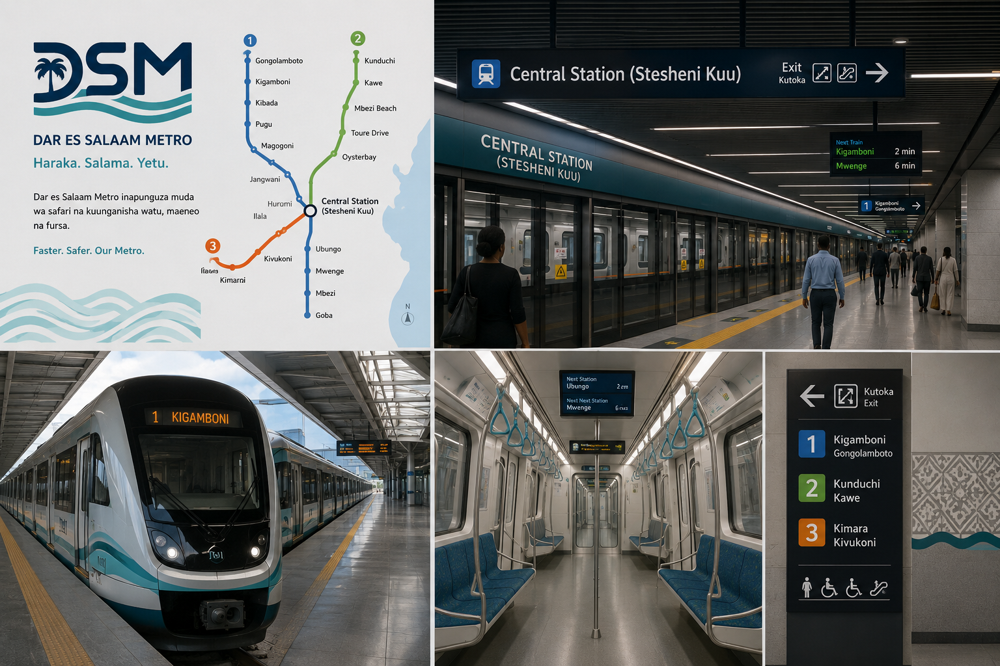

# Metro



A high-performance transit routing and real-time train tracking platform built with Go.

## Overview

Metro provides:

- Journey planning and route optimization
- Real-time train position tracking
- ETA prediction for stations
- Service disruption notifications
- WebSocket-based live updates for passengers

## Event Architecture

The system uses NATS as its event backbone.

### Train Position Updates

```text
train.position.{lineId}.{trainId}
```

Published by train tracking systems whenever a train reports a new location.

### Delay Events

```text
delay.event.{lineId}
```

Published when a delay or service disruption occurs on a line.

### ETA Updates

```text
eta.update.{stationId}
```

Published by ETA workers after recalculating station arrival times.

### Line Status Updates

```text
line.status.{lineId}
```

Published when a line's operational status changes.

## Event Flow

```text
Train
  ↓
NATS
  ↓
ETA Workers
  ↓
Cache Invalidator
  ↓
WebSocket Hub
  ↓
Clients
```
